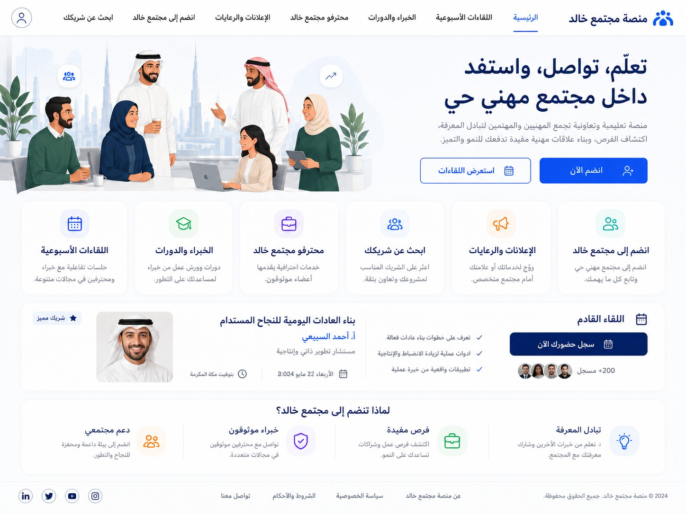
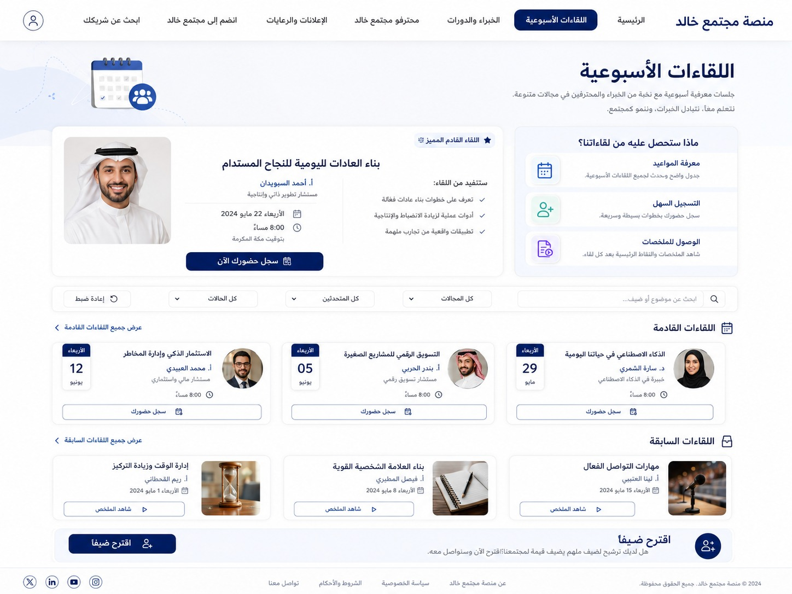
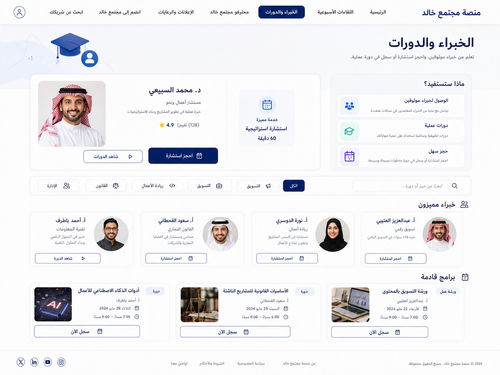
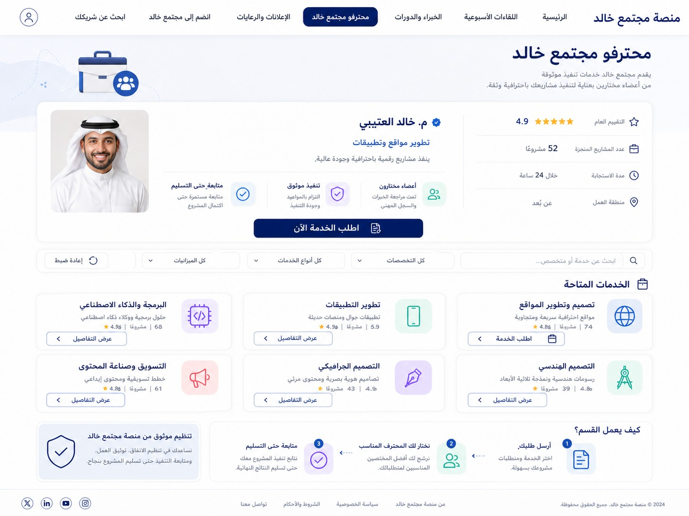
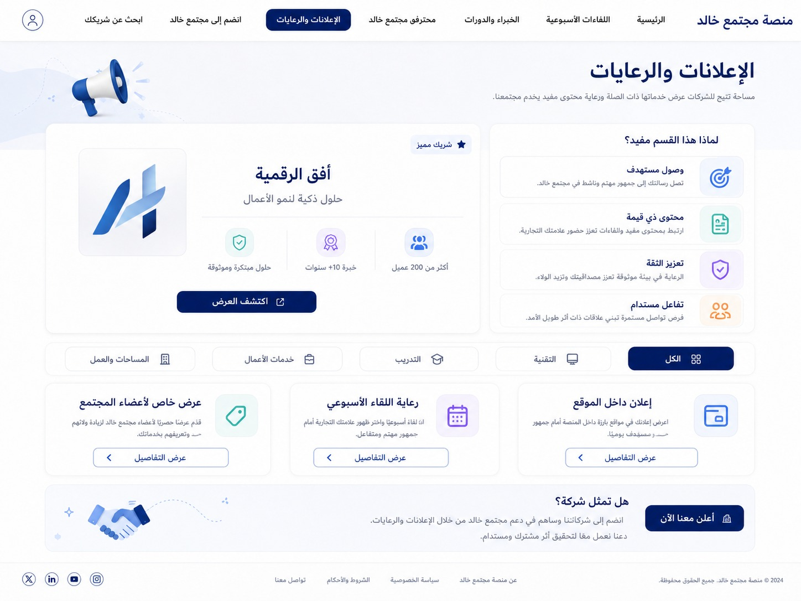
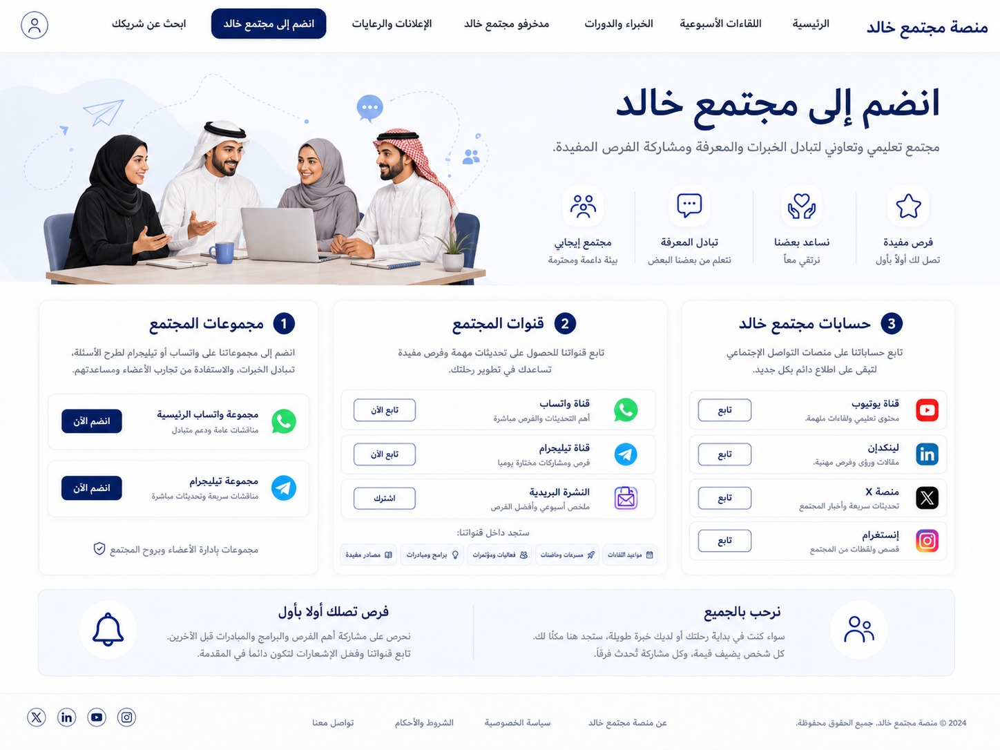
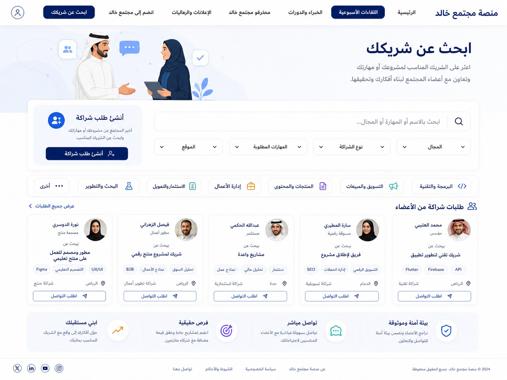

# 🌟 WB — AI-Native Community & Professional Ecosystem

<div align="center">


**Connecting People, Knowledge, Opportunities, Services & Organizations in One Intelligent Ecosystem**

[📖 Table of Contents](#table-of-contents) • [🚀 Getting Started](#getting-started) • [🤝 Contributing](#contributing)

</div>

---

## Table of Contents

- [🌟 Overview](#overview)
- [🎯 Vision & Mission](#vision--mission)
- [📊 Quick Stats](#quick-stats)
- [⚖️ Key Principles](#key-principles)
- [🎨 Product Strategy](#product-strategy)
- [🏗️ Architecture](#architecture)
- [💻 Technology Stack](#technology-stack)
- [🤖 AI Architecture](#ai-architecture)
- [🔒 Security & Privacy](#security--privacy)
- [🧩 Platform Layers](#platform-layers)
- [🗺️ Roadmap](#roadmap)
- [📁 Repository Structure](#repository-structure)
- [🖼️ Screenshots](#screenshots)
- [📄 License](#license)

---

## Overview

WB is an **AI-native community super-platform** that seamlessly connects people, knowledge, opportunities, services, organizations, and trusted collaboration in one intelligent ecosystem. 

🌍 **Strategic Position**: Saudi-first, then GCC, Arab, and global expansion with Arabic and English as first-class languages and Arabic-first UX.

The platform combines the reach of a community, the utility of a professional network, the depth of a learning platform, the transaction capability of a marketplace, and the intelligence of an AI-native operating layer.

---

## 🎯 Vision & Mission

### Vision
WB aims to become a global platform originating from the Arab market where people and organizations can learn, connect, collaborate, discover opportunities, provide and obtain professional services, and build trusted relationships.

### Mission
WB enables people and organizations to turn community participation into practical value: knowledge, trusted relationships, collaboration, opportunities, services, and sustainable economic activity.

The platform makes it easier to find the right person, knowledge, service, and opportunity while protecting users and maintaining community quality.

---

## 📊 Quick Stats

- 🎯 **Target Scale**: 1,000 → 100,000 → 1,000,000+ users
- 🚀 **Development Phases**: 5-phase roadmap from Foundation to Autonomous Platform
- 🌐 **Market Strategy**: Saudi-first → GCC → Arab → Global
- 🗣️ **Languages**: Arabic & English (Arabic-first UX)
- 🏗️ **Architecture**: Modular monolith with service extraction path
- 🤖 **AI Integration**: Provider-agnostic AI Gateway with governed agents

---

## ⚖️ Key Principles

WB is governed by 15 non-negotiable principles:

1. 🎯 User value before feature volume
2. 🛡️ Trust before growth
3. 🔐 Security and privacy by design
4. 🌐 Arabic and English are first-class
5. 🧩 Modular architecture before premature microservices
6. 🤖 Provider-agnostic AI
7. 👤 Human control over high-risk autonomous actions
8. 📊 Transparent trust signals
9. ♿ Accessibility by default
10. 🔍 Observable and testable systems
11. ⚖️ Compliance by design
12. 🔄 Prefer reversible decisions where practical
13. 📚 Documentation is durable context for humans and AI agents
14. 🎯 Avoid artificial technical complexity
15. 📋 Every major capability requires ownership, lifecycle, security, and acceptance criteria

---

## 🎨 Product Strategy

WB is a **hybrid AI-native community super-platform** with four core ecosystem flows:

### Core Flows
- 👥 **People ↔ Knowledge**: Learning, expertise, content sharing
- 💼 **People ↔ Opportunities**: Jobs, projects, partnerships
- 🛠️ **People ↔ Services**: Professional services, transactions
- 🏢 **Organizations ↔ Community**: Business engagement, ecosystem participation

### Core Loop
```
discover → connect → collaborate → transact or learn → complete → review → contribute → strengthen trust
```

### Product Components

#### 🏘️ Community
Free participation, groups, discussions, events, recognition, and knowledge sharing.

#### 💼 Professional Ecosystem
Professional identities, expertise, services, partnerships, organizations, jobs, projects, and opportunities.

#### 📚 Learning
Scalable LMS supporting courses, programs, lessons, assessments, progress, certificates, cohorts, and AI assistance.

#### 🛒 Marketplace
Experts, services, courses, and commercial offerings with transaction, settlement, dispute, and review workflows.

#### 🤖 AI Intelligence
AI improves discovery, matching, onboarding, moderation, personalization, support, analytics, and controlled automation.

---

## 🏗️ Architecture

WB starts as a **modular monolith** with explicit domain boundaries and a clear path to service extraction when justified by scale, reliability, security, team ownership, or deployment independence.

### Core Modules
- 🔐 Identity & Authentication
- 👥 Community & Social
- 📅 Events Management
- 📚 Learning Management
- 🛒 Marketplace & Commerce
- 🛠️ Services & Experts
- 🤝 Partnerships
- 💼 Opportunities & Jobs
- 🏢 Organizations
- 💳 Payments & Settlement
- 📨 Messaging & Notifications
- 🔍 Search & Matching
- 🛡️ Trust & Safety
- 📢 Advertising
- 📊 Analytics
- 🤖 AI & Automation
- 📁 File Management
- 🔬 Audit & Compliance

### Design Principles
- Each domain owns its transactional data
- Synchronous APIs for direct operations
- Asynchronous domain events for decoupled workflows
- REST/OpenAPI as default external interface
- WebSockets only where real-time behavior adds clear value

---

## 💻 Technology Stack

<div align="center">

### Frontend


### Backend


### Database & Storage


### Infrastructure


</div>

### Complete Stack
- **Frontend**: Next.js, React, TypeScript, Tailwind CSS, shadcn/ui
- **Backend**: NestJS and TypeScript
- **Database**: PostgreSQL with Redis for caching and queues
- **Search**: PostgreSQL full-text search initially; OpenSearch for advanced needs
- **Storage**: S3-compatible object storage
- **API**: REST/OpenAPI with WebSockets where required
- **Containers**: Docker for containerization
- **CI/CD**: GitHub Actions for continuous integration and deployment
- **Observability**: OpenTelemetry-compatible telemetry
- **Testing**: Unit, integration, API, E2E, security, accessibility, and performance testing
- **AI**: Provider-agnostic AI Gateway supporting commercial and open models

---

## 🤖 AI Architecture

AI is a **platform capability** rather than a single chatbot. The architecture includes:

### AI Components
- 🚪 **AI Gateway**: Provider-agnostic model access
- 🔌 **Model Adapters**: Support for multiple AI providers
- 📝 **Prompt/Context Management**: Dynamic context handling
- 🔍 **Retrieval**: Knowledge base integration
- 🛠️ **Tool Execution**: Safe AI action capabilities
- 🎭 **Agent Orchestration**: Coordinated specialist agents
- 📊 **Evaluation**: Performance and quality measurement
- 👁️ **Observability**: AI operation monitoring
- 🛡️ **Policy Enforcement**: Safety and compliance guardrails
- 📋 **Auditability**: Complete action logging

### Core Principle
AI never bypasses authorization; every tool action executes under a defined capability and policy.

---

## 🤖 AI Orchestration & Agents

### Orchestrator
The Orchestrator coordinates specialist agents, routes work, resolves conflicts, enforces context boundaries, records decisions, and prevents unsafe actions.

### Specialist Agents
- 🏗️ **Product Architect**: Protects product coherence
- 🧠 **AI Systems Designer**: Owns AI architecture
- 🛡️ **Security & Trust Guardian**: Challenges unsafe designs
- 🌐 **Ecosystem Strategist**: Protects ecosystem and commercial coherence
- 💻 **Developer Lead**: Owns implementation quality
- 🎨 **UX & Localization Specialist**: Protects usability, Arabic/English parity, RTL, accessibility
- ✅ **QA & Verification Agent**: Quality assurance
- 📊 **Data & Analytics Agent**: Data insights
- 🔧 **DevOps/SRE Agent**: Infrastructure reliability
- ⚖️ **Compliance & Privacy Guardian**: Regulatory compliance
- 👥 **Community Intelligence Agent**: Community insights

### AI Skills
Reusable capabilities including architecture review, security audit, feature planning, implementation, code review, database design, API design, UI implementation, UX review, localization, testing, performance analysis, DevOps, incident analysis, compliance review, documentation maintenance, research, and release preparation.

### Key Constraint
No specialist may override platform security, compliance, or authorization policies.

---

## 🔒 Security & Privacy

### Security Architecture
Security spans identity, authorization, validation, business rules, data protection, auditability, monitoring, and incident response.

- **Baseline**: OWASP ASVS Level 2
- **Enhanced Controls**: Stronger controls for identity, payments, administration, AI actions, and sensitive data
- **Components**: Secure IAM, secrets management, encryption, application security, API protection, secure file handling, supply-chain security, monitoring, and incident response

### Privacy & Data Governance
WB follows data minimization, purpose limitation, access control, retention limits, transparency, user control, secure processing, and auditability.

#### User Control
Users control profile, contact, activity, location, social-link, AI-processing where applicable, and personalization preferences.

#### Data Classification
- 🌐 **Public**: Openly accessible information
- 🔒 **Internal**: Platform operational data
- 📊 **Confidential**: Business-sensitive information
- 🚨 **Sensitive**: Personal and protected data
- 🔐 **Highly Sensitive**: Critical security and financial data

---

## 🧩 Platform Layers

WB is organized into 11 architectural layers:

1. 🎨 **Experience**: Responsive web, PWA, localization, accessibility
2. 🆔 **Identity**: Accounts, profiles, authentication, authorization, verification
3. 👥 **Community**: Communities, groups, discussions, events, participation
4. 📚 **Knowledge**: Experts, courses, workshops, LMS, content
5. 💼 **Opportunity**: Jobs, projects, partnerships, collaboration
6. 🛒 **Marketplace**: Services, transactions, commissions, settlement
7. 🛡️ **Trust**: Reputation, verification, reviews, badges, safety signals
8. 🧠 **Intelligence**: Search, matching, recommendations, AI agents
9. 🔧 **Platform Services**: Payments, messaging, notifications, files, analytics
10. ⚖️ **Governance**: Moderation, compliance, audit, policy
11. 🏗️ **Infrastructure**: Cloud, databases, queues, storage, observability, CI/CD

---

## 🗺️ Roadmap

### Phase 0 — Foundation 🏗️
Constitution, architecture, design system, identity, security, infrastructure, CI/CD.

### Phase 1 — Community MVP 👥
Professional identity, communities, groups, discussions, events, discovery, notifications, moderation, admin.

### Phase 2 — Knowledge & Ecosystem 📚
Experts, services, partnerships, opportunities, LMS foundation, organizations.

### Phase 3 — Marketplace 🛒
Payments, transaction engine, provider adapters, settlement orchestration, reviews, disputes.

### Phase 4 — Intelligence 🧠
Semantic search, matching, recommendations, AI assistant, AI moderation, analytics intelligence.

### Phase 5 — Autonomous Platform 🚀
Governed agent workflows, ecosystem intelligence, advanced automation, federated communities, expanded APIs.

---

## 📁 Repository Structure

```
WB/
├── apps/                 # Application packages
├── packages/             # Shared libraries and components
├── services/             # Backend services
├── infrastructure/       # Infrastructure as code
├── docs/                 # Documentation
├── ai/                   # AI agents and skills
├── skills/               # Reusable skill definitions
├── tests/                # Test suites
├── scripts/              # Utility scripts
├── governance/           # Governance documents
├── decisions/            # Architecture decision records
├── roadmap/              # Roadmap documents
├── AGENTS.md            # AI agent instructions
├── PROJECT_INSTRUCTIONS.md # Project guidelines
├── README.md            # This file
└── LICENSE              # Proprietary license
```

---

## 🖼️ Screenshots

<div align="center">

### Platform Preview


*Platform Overview*


*User Interface*


*Community Features*


*Learning Management*


*Marketplace Integration*


*AI Capabilities*


*Analytics Dashboard*

</div>

---

## 🚀 Getting Started

### Foundation status

WB now contains an **interactive, local visible-platform demo** and a secure local/CI API foundation. The Next.js experience provides Arabic-first and English localized journeys across discovery, communities, events, and a private-profile preview through clearly labeled illustrative data. The NestJS API provides an OIDC-ready, private-by-default professional-profile boundary with PostgreSQL migrations, strict payload validation, scoped self-service access, rate limiting, and non-sensitive audit events. The demo does **not** yet connect to a selected identity provider, configured database, public profile search, payments, AI-provider integration, or production deployment. See `WB_INITIAL_ASSESSMENT.md`, `WB_IMPLEMENTATION_PLAN.md`, and the ADRs in `decisions/` for the current scope and sequencing.

### Prerequisites

- Node.js 22.13.0 (see `.nvmrc`)
- pnpm 11.21.0 (Corepack-managed)

PostgreSQL, Redis, Docker, cloud credentials, and third-party service configuration are intentionally not required for the foundation increment.

### Installation

```bash
# Clone the repository
git clone https://github.com/ma1amin/WB.git
cd WB

# Enable the repository-declared package manager and install the committed dependency graph
corepack enable
pnpm install --frozen-lockfile

# Create a local-only configuration file with safe defaults
cp .env.example .env

# Optional: after configuring a local/test PostgreSQL instance, apply the private-profile migration
pnpm --filter @wb/api db:migrate
```

### Development

Run the API and web applications in separate terminals.

```bash
# Terminal 1 — API
pnpm --filter @wb/api dev

# Terminal 2 — web experience
pnpm --filter @wb/web dev
```

The interactive web platform is served by the Next.js development server, typically at `http://localhost:3000`. It uses clearly labeled illustrative data and client-only state until the OIDC and PostgreSQL integrations are configured. The API health check is available at `http://127.0.0.1:3001/api/health` and returns only `{ "status": "ok" }`. The private profile endpoints are `GET` and `PUT` at `http://127.0.0.1:3001/api/v1/me/profile`; they require complete `OIDC_ISSUER`, `OIDC_AUDIENCE`, and `OIDC_JWKS_URI` configuration plus a PostgreSQL `DATABASE_URL`. Without those prerequisites, protected profile routes intentionally return a safe `503` rather than bypass authentication.

### Verification

```bash
# Run formatting, linting, strict type checks, unit tests, and production builds
pnpm check

# Review production dependency advisories at high severity or above
pnpm security:deps
```

The foundation does not define a production start or deployment command. Such commands will be added only after the required environment, security, backup, observability, and operational decisions have been reviewed.

---

## 🤝 Contributing

WB is currently in development. Contribution guidelines will be established as the project matures.

### Development Guidelines
- Follow the project constitution and principles
- Ensure security and privacy by design
- Maintain Arabic/English parity in features
- Write tests for new functionality
- Document changes and decisions

---

## 📄 License

**Proprietary License - All Rights Reserved**

Copyright © 2026 WB. All rights reserved.

This project is proprietary software. Unauthorized copying, distribution, modification, or use of this project is strictly prohibited.

---

<div align="center">

**Built with ❤️ for the Arab World and Beyond**

[🌐 Website](https://WB.com) • [📧 Contact](mailto:contact@WB.com) • [📱 Twitter](https://twitter.com/WB)

</div>
