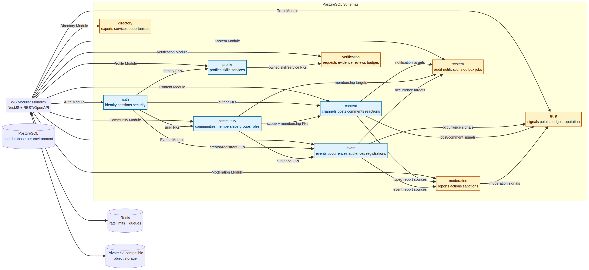
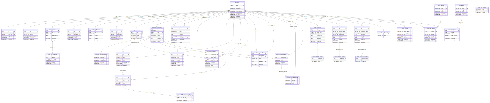
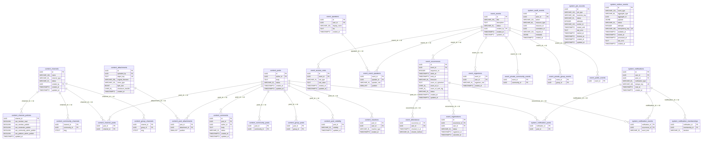
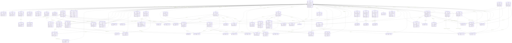
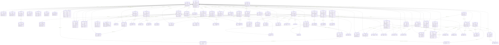

# WB PostgreSQL Full ERD — Canonical Database Foundation

> **Source of truth:** `database/migrations/002_modular_schemas.sql`. This document is generated from the migration so the ERD cannot silently drift from the executable schema.

The database is one PostgreSQL database per environment with one schema per Module. The database foundation includes future V1/Post-V1 tables from day one; Application Code activates them progressively in V0, V1, and later releases.

## Rendered diagrams

| Diagram | PNG | Editable Mermaid |
|---|---|---|
| Module Architecture | [01-wb-module-architecture.png](erd_diagrams/01-wb-module-architecture.png) | [01-wb-module-architecture.mmd](erd_diagrams/01-wb-module-architecture.mmd) |
| Auth/Profile/Community ERD | [02-wb-auth-profile-community.png](erd_diagrams/02-wb-auth-profile-community.png) | [02-wb-auth-profile-community.mmd](erd_diagrams/02-wb-auth-profile-community.mmd) |
| Content/Event/System ERD | [03-wb-content-event-system.png](erd_diagrams/03-wb-content-event-system.png) | [03-wb-content-event-system.mmd](erd_diagrams/03-wb-content-event-system.mmd) |
| Moderation and Verification ERD | [04-wb-moderation-verification.png](erd_diagrams/04-wb-moderation-verification.png) | [04-wb-moderation-verification.mmd](erd_diagrams/04-wb-moderation-verification.mmd) |
| Directory and Trust ERD | [05-wb-directory-trust.png](erd_diagrams/05-wb-directory-trust.png) | [05-wb-directory-trust.mmd](erd_diagrams/05-wb-directory-trust.mmd) |
| Full ERD | [full-schema-erd.png](erd_diagrams/full-schema-erd.png) | [full-schema-erd.mmd](erd_diagrams/full-schema-erd.mmd) |

## Diagram images

## Conventions

| Convention | Rule |
|---|---|
| Database | One PostgreSQL database per environment: local, staging, production. |
| Schemas | `public`, `auth`, `profile`, `community`, `content`, `moderation`, `verification`, `event`, `directory`, `trust`, `system`. |
| Identity | `auth.users` is the only identity root. |
| Integrity | Cross-schema Foreign Keys are explicit. Business ownership is enforced in NestJS Ports/Repositories. |
| Polymorphism | Business polymorphic FKs are prohibited; audit/outbox envelopes are the only documented exceptions. |
| Events | V0 creates one `event.occurrences` row; recurrence is activated later without schema redesign. |
| Groups | V0 uses inherited Community access; V1 can activate `group_memberships` independently. |
| Secrets | Zoom URL is encrypted at application boundary; DB stores ciphertext, IV, and authentication tag. |
| Deletion | Published/history-bearing rows use status or revocation; hard delete is restricted. |

## Schema `auth`

### `auth.email_verification_tokens`

| Column | PostgreSQL type | Null | Key / FK |
|---|---|---|---|
| `id` | `UUID` | No | PK |
| `user_id` | `UUID` | No | NN,FK; FK -> auth.users(id) |
| `token_hash` | `CHAR(64)` | No | UK,NN |
| `expires_at` | `TIMESTAMPTZ` | No | NN |
| `used_at` | `TIMESTAMPTZ` | Yes |  |
| `created_at` | `TIMESTAMPTZ` | No | NN |

### `auth.identities`

| Column | PostgreSQL type | Null | Key / FK |
|---|---|---|---|
| `id` | `UUID` | No | PK |
| `user_id` | `UUID` | No | NN,FK; FK -> auth.users(id) |
| `provider` | `VARCHAR(40)` | No | NN |
| `provider_subject` | `VARCHAR(255)` | No | NN |
| `created_at` | `TIMESTAMPTZ` | No | NN |
| `updated_at` | `TIMESTAMPTZ` | No | NN |

### `auth.mfa_challenges`

| Column | PostgreSQL type | Null | Key / FK |
|---|---|---|---|
| `id` | `UUID` | No | PK |
| `factor_id` | `UUID` | No | NN,FK; FK -> auth.mfa_factors(id) |
| `challenge_hash` | `CHAR(64)` | No | UK,NN |
| `expires_at` | `TIMESTAMPTZ` | No | NN |
| `used_at` | `TIMESTAMPTZ` | Yes |  |
| `created_at` | `TIMESTAMPTZ` | No | NN |

### `auth.mfa_factors`

| Column | PostgreSQL type | Null | Key / FK |
|---|---|---|---|
| `id` | `UUID` | No | PK |
| `user_id` | `UUID` | No | NN,FK; FK -> auth.users(id) |
| `factor_type` | `VARCHAR(40)` | No | NN |
| `secret_reference` | `TEXT` | No | NN |
| `verified_at` | `TIMESTAMPTZ` | Yes |  |
| `disabled_at` | `TIMESTAMPTZ` | Yes |  |
| `created_at` | `TIMESTAMPTZ` | No | NN |

### `auth.password_reset_tokens`

| Column | PostgreSQL type | Null | Key / FK |
|---|---|---|---|
| `id` | `UUID` | No | PK |
| `user_id` | `UUID` | No | NN,FK; FK -> auth.users(id) |
| `token_hash` | `CHAR(64)` | No | UK,NN |
| `expires_at` | `TIMESTAMPTZ` | No | NN |
| `used_at` | `TIMESTAMPTZ` | Yes |  |
| `created_at` | `TIMESTAMPTZ` | No | NN |

### `auth.security_events`

| Column | PostgreSQL type | Null | Key / FK |
|---|---|---|---|
| `id` | `UUID` | No | PK |
| `user_id` | `UUID` | Yes | FK; FK -> auth.users(id) |
| `event_type` | `VARCHAR(80)` | No | NN |
| `ip_hash` | `CHAR(64)` | Yes |  |
| `user_agent_hash` | `CHAR(64)` | Yes |  |
| `metadata` | `JSONB` | No | NN |
| `created_at` | `TIMESTAMPTZ` | No | NN |

### `auth.sessions`

| Column | PostgreSQL type | Null | Key / FK |
|---|---|---|---|
| `id` | `UUID` | No | PK |
| `user_id` | `UUID` | No | NN,FK; FK -> auth.users(id) |
| `token_hash` | `CHAR(64)` | No | UK,NN |
| `expires_at` | `TIMESTAMPTZ` | No | NN |
| `revoked_at` | `TIMESTAMPTZ` | Yes |  |
| `created_at` | `TIMESTAMPTZ` | No | NN |

### `auth.user_phones`

| Column | PostgreSQL type | Null | Key / FK |
|---|---|---|---|
| `user_id` | `UUID` | No | PK,FK; FK -> auth.users(id) |
| `phone_e164` | `VARCHAR(16)` | No | UK,NN |
| `verified_at` | `TIMESTAMPTZ` | Yes |  |
| `created_at` | `TIMESTAMPTZ` | No | NN |
| `updated_at` | `TIMESTAMPTZ` | No | NN |

### `auth.users`

| Column | PostgreSQL type | Null | Key / FK |
|---|---|---|---|
| `id` | `UUID` | No | PK |
| `email` | `CITEXT` | No | UK,NN |
| `password_hash` | `TEXT` | No | NN |
| `platform_role` | `VARCHAR(40)` | No | NN |
| `status` | `VARCHAR(30)` | No | NN |
| `email_verified_at` | `TIMESTAMPTZ` | Yes |  |
| `email_changed_at` | `TIMESTAMPTZ` | Yes |  |
| `deleted_at` | `TIMESTAMPTZ` | Yes |  |
| `created_at` | `TIMESTAMPTZ` | No | NN |
| `updated_at` | `TIMESTAMPTZ` | No | NN |

## Schema `community`

### `community.communities`

| Column | PostgreSQL type | Null | Key / FK |
|---|---|---|---|
| `id` | `UUID` | No | PK |
| `name` | `VARCHAR(160)` | No | NN |
| `slug` | `CITEXT` | No | UK,NN |
| `description` | `TEXT` | No | NN |
| `visibility` | `VARCHAR(20)` | No | NN |
| `status` | `VARCHAR(20)` | No | NN |
| `created_by` | `UUID` | No | NN,FK; FK -> auth.users(id) |
| `created_at` | `TIMESTAMPTZ` | No | NN |
| `updated_at` | `TIMESTAMPTZ` | No | NN |

### `community.community_creation_requests`

| Column | PostgreSQL type | Null | Key / FK |
|---|---|---|---|
| `id` | `UUID` | No | PK |
| `requested_by` | `UUID` | No | NN,FK; FK -> auth.users(id) |
| `name` | `VARCHAR(160)` | No | NN |
| `slug` | `CITEXT` | No | NN |
| `description` | `TEXT` | No | NN |
| `status` | `VARCHAR(25)` | No | NN |
| `reviewed_by` | `UUID` | Yes | FK; FK -> auth.users(id) |
| `reviewed_at` | `TIMESTAMPTZ` | Yes |  |
| `created_at` | `TIMESTAMPTZ` | No | NN |
| `updated_at` | `TIMESTAMPTZ` | No | NN |

### `community.community_settings`

| Column | PostgreSQL type | Null | Key / FK |
|---|---|---|---|
| `community_id` | `UUID` | No | PK,FK; FK -> community.communities(id) |
| `join_policy` | `VARCHAR(30)` | No | NN |
| `content_policy` | `VARCHAR(30)` | No | NN |
| `default_visibility` | `VARCHAR(30)` | No | NN |
| `created_at` | `TIMESTAMPTZ` | No | NN |
| `updated_at` | `TIMESTAMPTZ` | No | NN |

### `community.group_membership_roles`

| Column | PostgreSQL type | Null | Key / FK |
|---|---|---|---|
| `group_membership_id` | `UUID` | No | NN,FK; FK -> community.group_memberships(id) |
| `role_code` | `VARCHAR(40)` | No | NN |
| `assigned_by` | `UUID` | Yes | FK; FK -> auth.users(id) |
| `created_at` | `TIMESTAMPTZ` | No | NN |

### `community.group_memberships`

| Column | PostgreSQL type | Null | Key / FK |
|---|---|---|---|
| `id` | `UUID` | No | PK |
| `group_id` | `UUID` | No | NN,FK; FK -> community.groups(id) |
| `user_id` | `UUID` | No | NN,FK; FK -> auth.users(id) |
| `status` | `VARCHAR(25)` | No | NN |
| `created_at` | `TIMESTAMPTZ` | No | NN |
| `updated_at` | `TIMESTAMPTZ` | No | NN |

### `community.groups`

| Column | PostgreSQL type | Null | Key / FK |
|---|---|---|---|
| `id` | `UUID` | No | PK |
| `community_id` | `UUID` | No | NN,FK; FK -> community.communities(id) |
| `name` | `VARCHAR(160)` | No | NN |
| `description` | `TEXT` | No | NN |
| `status` | `VARCHAR(20)` | No | NN |
| `created_by` | `UUID` | No | NN,FK; FK -> auth.users(id) |
| `created_at` | `TIMESTAMPTZ` | No | NN |
| `updated_at` | `TIMESTAMPTZ` | No | NN |

### `community.invitations`

| Column | PostgreSQL type | Null | Key / FK |
|---|---|---|---|
| `id` | `UUID` | No | PK |
| `community_id` | `UUID` | No | NN,FK; FK -> community.communities(id) |
| `invited_user_id` | `UUID` | Yes | FK; FK -> auth.users(id) |
| `invited_email` | `CITEXT` | Yes |  |
| `token_hash` | `CHAR(64)` | No | UK,NN |
| `invited_by` | `UUID` | No | NN,FK; FK -> auth.users(id) |
| `expires_at` | `TIMESTAMPTZ` | No | NN |
| `accepted_at` | `TIMESTAMPTZ` | Yes |  |
| `status` | `VARCHAR(20)` | No | NN |
| `created_at` | `TIMESTAMPTZ` | No | NN |

### `community.membership_requests`

| Column | PostgreSQL type | Null | Key / FK |
|---|---|---|---|
| `id` | `UUID` | No | PK |
| `community_id` | `UUID` | No | NN,FK; FK -> community.communities(id) |
| `user_id` | `UUID` | No | NN,FK; FK -> auth.users(id) |
| `status` | `VARCHAR(25)` | No | NN |
| `reason` | `VARCHAR(500)` | Yes |  |
| `reviewed_by` | `UUID` | Yes | FK; FK -> auth.users(id) |
| `reviewed_at` | `TIMESTAMPTZ` | Yes |  |
| `created_at` | `TIMESTAMPTZ` | No | NN |
| `updated_at` | `TIMESTAMPTZ` | No | NN |

### `community.membership_roles`

| Column | PostgreSQL type | Null | Key / FK |
|---|---|---|---|
| `membership_id` | `UUID` | No | NN,FK; FK -> community.memberships(id) |
| `role_code` | `VARCHAR(40)` | No | NN |
| `assigned_by` | `UUID` | Yes | FK; FK -> auth.users(id) |
| `created_at` | `TIMESTAMPTZ` | No | NN |

### `community.memberships`

| Column | PostgreSQL type | Null | Key / FK |
|---|---|---|---|
| `id` | `UUID` | No | PK |
| `community_id` | `UUID` | No | NN,FK; FK -> community.communities(id) |
| `user_id` | `UUID` | No | NN,FK; FK -> auth.users(id) |
| `status` | `VARCHAR(25)` | No | NN |
| `created_at` | `TIMESTAMPTZ` | No | NN |
| `updated_at` | `TIMESTAMPTZ` | No | NN |

### `community.rules`

| Column | PostgreSQL type | Null | Key / FK |
|---|---|---|---|
| `id` | `UUID` | No | PK |
| `community_id` | `UUID` | No | NN,FK; FK -> community.communities(id) |
| `title` | `VARCHAR(180)` | No | NN |
| `body` | `TEXT` | No | NN |
| `position` | `INTEGER` | No | NN |
| `status` | `VARCHAR(20)` | No | NN |
| `created_at` | `TIMESTAMPTZ` | No | NN |
| `updated_at` | `TIMESTAMPTZ` | No | NN |

## Schema `content`

### `content.attachments`

| Column | PostgreSQL type | Null | Key / FK |
|---|---|---|---|
| `id` | `UUID` | No | PK |
| `uploaded_by` | `UUID` | No | NN,FK; FK -> auth.users(id) |
| `object_key` | `TEXT` | No | UK,NN |
| `original_filename` | `VARCHAR(255)` | No | NN |
| `mime_type` | `VARCHAR(120)` | No | NN |
| `byte_size` | `BIGINT` | No | NN |
| `checksum_sha256` | `CHAR(64)` | Yes |  |
| `created_at` | `TIMESTAMPTZ` | No | NN |

### `content.channel_policies`

| Column | PostgreSQL type | Null | Key / FK |
|---|---|---|---|
| `channel_id` | `UUID` | No | PK,FK; FK -> content.channels(id) |
| `can_member_read` | `BOOLEAN` | No | NN |
| `can_member_publish` | `BOOLEAN` | No | NN |
| `can_moderator_publish` | `BOOLEAN` | No | NN |
| `can_community_admin_publish` | `BOOLEAN` | No | NN |
| `can_platform_admin_publish` | `BOOLEAN` | No | NN |
| `updated_at` | `TIMESTAMPTZ` | No | NN |

### `content.channel_posts`

| Column | PostgreSQL type | Null | Key / FK |
|---|---|---|---|
| `post_id` | `UUID` | No | PK,FK; FK -> content.posts(id) |
| `channel_id` | `UUID` | No | NN,FK; FK -> content.channels(id) |

### `content.channels`

| Column | PostgreSQL type | Null | Key / FK |
|---|---|---|---|
| `id` | `UUID` | No | PK |
| `name` | `VARCHAR(160)` | No | NN |
| `channel_type` | `VARCHAR(30)` | No | NN |
| `status` | `VARCHAR(20)` | No | NN |
| `created_by` | `UUID` | No | NN,FK; FK -> auth.users(id) |
| `created_at` | `TIMESTAMPTZ` | No | NN |
| `updated_at` | `TIMESTAMPTZ` | No | NN |

### `content.comments`

| Column | PostgreSQL type | Null | Key / FK |
|---|---|---|---|
| `id` | `UUID` | No | PK |
| `post_id` | `UUID` | No | NN,FK; FK -> content.posts(id) |
| `author_id` | `UUID` | No | NN,FK; FK -> auth.users(id) |
| `body` | `TEXT` | No | NN |
| `status` | `VARCHAR(20)` | No | NN |
| `created_at` | `TIMESTAMPTZ` | No | NN |
| `updated_at` | `TIMESTAMPTZ` | No | NN |

### `content.community_channels`

| Column | PostgreSQL type | Null | Key / FK |
|---|---|---|---|
| `channel_id` | `UUID` | No | PK,FK; FK -> content.channels(id) |
| `community_id` | `UUID` | No | NN,FK; FK -> community.communities(id) |
| `slug` | `CITEXT` | No | NN |

### `content.community_posts`

| Column | PostgreSQL type | Null | Key / FK |
|---|---|---|---|
| `post_id` | `UUID` | No | PK,FK; FK -> content.posts(id) |
| `community_id` | `UUID` | No | NN,FK; FK -> community.communities(id) |

### `content.group_channels`

| Column | PostgreSQL type | Null | Key / FK |
|---|---|---|---|
| `channel_id` | `UUID` | No | PK,FK; FK -> content.channels(id) |
| `group_id` | `UUID` | No | NN,FK; FK -> community.groups(id) |
| `slug` | `CITEXT` | No | NN |

### `content.group_posts`

| Column | PostgreSQL type | Null | Key / FK |
|---|---|---|---|
| `post_id` | `UUID` | No | PK,FK; FK -> content.posts(id) |
| `group_id` | `UUID` | No | NN,FK; FK -> community.groups(id) |

### `content.post_attachments`

| Column | PostgreSQL type | Null | Key / FK |
|---|---|---|---|
| `post_id` | `UUID` | No | NN,FK; FK -> content.posts(id) |
| `attachment_id` | `UUID` | No | NN,FK; FK -> content.attachments(id) |
| `position` | `SMALLINT` | No | NN |

### `content.post_visibility`

| Column | PostgreSQL type | Null | Key / FK |
|---|---|---|---|
| `post_id` | `UUID` | No | PK,FK; FK -> content.posts(id) |
| `visibility` | `VARCHAR(30)` | No | NN |
| `updated_at` | `TIMESTAMPTZ` | No | NN |

### `content.posts`

| Column | PostgreSQL type | Null | Key / FK |
|---|---|---|---|
| `id` | `UUID` | No | PK |
| `author_id` | `UUID` | No | NN,FK; FK -> auth.users(id) |
| `body` | `TEXT` | No | NN |
| `status` | `VARCHAR(20)` | No | NN |
| `created_at` | `TIMESTAMPTZ` | No | NN |
| `updated_at` | `TIMESTAMPTZ` | No | NN |

### `content.reactions`

| Column | PostgreSQL type | Null | Key / FK |
|---|---|---|---|
| `post_id` | `UUID` | No | NN,FK; FK -> content.posts(id) |
| `user_id` | `UUID` | No | NN,FK; FK -> auth.users(id) |
| `reaction_type` | `VARCHAR(30)` | No | NN |
| `created_at` | `TIMESTAMPTZ` | No | NN |

## Schema `directory`

### `directory.expert_listing_communities`

| Column | PostgreSQL type | Null | Key / FK |
|---|---|---|---|
| `listing_id` | `UUID` | No | NN,FK; FK -> directory.expert_listings(id) |
| `community_id` | `UUID` | No | NN,FK; FK -> community.communities(id) |
| `visibility` | `VARCHAR(30)` | No | NN |
| `created_at` | `TIMESTAMPTZ` | No | NN |

### `directory.expert_listings`

| Column | PostgreSQL type | Null | Key / FK |
|---|---|---|---|
| `id` | `UUID` | No | PK |
| `user_id` | `UUID` | No | NN,FK; FK -> auth.users(id) |
| `headline` | `VARCHAR(180)` | No | NN |
| `summary` | `TEXT` | No | NN |
| `status` | `VARCHAR(20)` | No | NN |
| `created_at` | `TIMESTAMPTZ` | No | NN |
| `updated_at` | `TIMESTAMPTZ` | No | NN |

### `directory.opportunities`

| Column | PostgreSQL type | Null | Key / FK |
|---|---|---|---|
| `id` | `UUID` | No | PK |
| `created_by` | `UUID` | No | NN,FK; FK -> auth.users(id) |
| `title` | `VARCHAR(240)` | No | NN |
| `description` | `TEXT` | No | NN |
| `status` | `VARCHAR(20)` | No | NN |
| `published_at` | `TIMESTAMPTZ` | Yes |  |
| `created_at` | `TIMESTAMPTZ` | No | NN |
| `updated_at` | `TIMESTAMPTZ` | No | NN |

### `directory.opportunity_communities`

| Column | PostgreSQL type | Null | Key / FK |
|---|---|---|---|
| `opportunity_id` | `UUID` | No | NN,FK; FK -> directory.opportunities(id) |
| `community_id` | `UUID` | No | NN,FK; FK -> community.communities(id) |
| `created_at` | `TIMESTAMPTZ` | No | NN |

### `directory.partnership_communities`

| Column | PostgreSQL type | Null | Key / FK |
|---|---|---|---|
| `partnership_id` | `UUID` | No | NN,FK; FK -> directory.partnerships(id) |
| `community_id` | `UUID` | No | NN,FK; FK -> community.communities(id) |
| `created_at` | `TIMESTAMPTZ` | No | NN |

### `directory.partnerships`

| Column | PostgreSQL type | Null | Key / FK |
|---|---|---|---|
| `id` | `UUID` | No | PK |
| `created_by` | `UUID` | No | NN,FK; FK -> auth.users(id) |
| `title` | `VARCHAR(240)` | No | NN |
| `description` | `TEXT` | No | NN |
| `status` | `VARCHAR(20)` | No | NN |
| `published_at` | `TIMESTAMPTZ` | Yes |  |
| `created_at` | `TIMESTAMPTZ` | No | NN |
| `updated_at` | `TIMESTAMPTZ` | No | NN |

### `directory.service_listings`

| Column | PostgreSQL type | Null | Key / FK |
|---|---|---|---|
| `id` | `UUID` | No | PK |
| `user_service_id` | `UUID` | No | NN,FK; FK -> profile.user_services(id) |
| `headline` | `VARCHAR(180)` | No | NN |
| `description` | `TEXT` | No | NN |
| `status` | `VARCHAR(20)` | No | NN |
| `created_at` | `TIMESTAMPTZ` | No | NN |
| `updated_at` | `TIMESTAMPTZ` | No | NN |

## Schema `event`

### `event.access_rules`

| Column | PostgreSQL type | Null | Key / FK |
|---|---|---|---|
| `id` | `UUID` | No | PK |
| `event_id` | `UUID` | No | NN,FK; FK -> event.events(id) |
| `rule_type` | `VARCHAR(40)` | No | NN |
| `rule_value` | `TEXT` | Yes |  |
| `created_at` | `TIMESTAMPTZ` | No | NN |
| `updated_at` | `TIMESTAMPTZ` | No | NN |

### `event.attendance`

| Column | PostgreSQL type | Null | Key / FK |
|---|---|---|---|
| `occurrence_id` | `UUID` | No | NN,FK; FK -> event.occurrences(id) |
| `user_id` | `UUID` | No | NN,FK; FK -> auth.users(id) |
| `checked_in_at` | `TIMESTAMPTZ` | No | NN |
| `checkin_method` | `VARCHAR(30)` | No | NN |

### `event.event_speakers`

| Column | PostgreSQL type | Null | Key / FK |
|---|---|---|---|
| `event_id` | `UUID` | No | NN,FK; FK -> event.events(id) |
| `speaker_id` | `UUID` | No | NN,FK; FK -> event.speakers(id) |
| `speaker_role` | `VARCHAR(40)` | No | NN |
| `position` | `SMALLINT` | No | NN |

### `event.events`

| Column | PostgreSQL type | Null | Key / FK |
|---|---|---|---|
| `id` | `UUID` | No | PK |
| `title` | `VARCHAR(240)` | No | NN |
| `description` | `TEXT` | No | NN |
| `status` | `VARCHAR(20)` | No | NN |
| `created_by` | `UUID` | No | NN,FK; FK -> auth.users(id) |
| `created_at` | `TIMESTAMPTZ` | No | NN |
| `updated_at` | `TIMESTAMPTZ` | No | NN |

### `event.occurrences`

| Column | PostgreSQL type | Null | Key / FK |
|---|---|---|---|
| `id` | `UUID` | No | PK |
| `event_id` | `UUID` | No | NN,FK; FK -> event.events(id) |
| `sequence_no` | `INTEGER` | No | NN |
| `starts_at` | `TIMESTAMPTZ` | No | NN |
| `ends_at` | `TIMESTAMPTZ` | Yes |  |
| `timezone` | `VARCHAR(80)` | No | NN |
| `zoom_url_ciphertext` | `TEXT` | No | NN |
| `zoom_url_iv` | `CHAR(16)` | No | NN |
| `zoom_url_auth_tag` | `CHAR(24)` | No | NN |
| `status` | `VARCHAR(20)` | No | NN |
| `created_at` | `TIMESTAMPTZ` | No | NN |
| `updated_at` | `TIMESTAMPTZ` | No | NN |

### `event.organizers`

| Column | PostgreSQL type | Null | Key / FK |
|---|---|---|---|
| `event_id` | `UUID` | No | NN,FK; FK -> event.events(id) |
| `user_id` | `UUID` | No | NN,FK; FK -> auth.users(id) |
| `organizer_role` | `VARCHAR(40)` | No | NN |
| `created_at` | `TIMESTAMPTZ` | No | NN |

### `event.private_community_events`

| Column | PostgreSQL type | Null | Key / FK |
|---|---|---|---|
| `event_id` | `UUID` | No | PK,FK; FK -> event.events(id) |
| `community_id` | `UUID` | No | NN,FK; FK -> community.communities(id) |

### `event.private_group_events`

| Column | PostgreSQL type | Null | Key / FK |
|---|---|---|---|
| `event_id` | `UUID` | No | PK,FK; FK -> event.events(id) |
| `group_id` | `UUID` | No | NN,FK; FK -> community.groups(id) |

### `event.public_events`

| Column | PostgreSQL type | Null | Key / FK |
|---|---|---|---|
| `event_id` | `UUID` | No | PK,FK; FK -> event.events(id) |

### `event.registrations`

| Column | PostgreSQL type | Null | Key / FK |
|---|---|---|---|
| `id` | `UUID` | No | PK |
| `occurrence_id` | `UUID` | No | NN,FK; FK -> event.occurrences(id) |
| `user_id` | `UUID` | No | NN,FK; FK -> auth.users(id) |
| `status` | `VARCHAR(20)` | No | NN |
| `registered_at` | `TIMESTAMPTZ` | No | NN |
| `cancelled_at` | `TIMESTAMPTZ` | Yes |  |

### `event.speakers`

| Column | PostgreSQL type | Null | Key / FK |
|---|---|---|---|
| `id` | `UUID` | No | PK |
| `user_id` | `UUID` | Yes | FK; FK -> auth.users(id) |
| `display_name` | `VARCHAR(160)` | No | NN |
| `bio` | `TEXT` | Yes |  |
| `created_at` | `TIMESTAMPTZ` | No | NN |

## Schema `moderation`

### `moderation.actions`

| Column | PostgreSQL type | Null | Key / FK |
|---|---|---|---|
| `id` | `UUID` | No | PK |
| `report_id` | `UUID` | No | NN,FK; FK -> moderation.reports(id) |
| `moderator_id` | `UUID` | No | NN,FK; FK -> auth.users(id) |
| `action_type` | `VARCHAR(40)` | No | NN |
| `reason` | `TEXT` | No | NN |
| `created_at` | `TIMESTAMPTZ` | No | NN |

### `moderation.report_comment_targets`

| Column | PostgreSQL type | Null | Key / FK |
|---|---|---|---|
| `report_id` | `UUID` | No | PK,FK; FK -> moderation.reports(id) |
| `comment_id` | `UUID` | No | NN,FK; FK -> content.comments(id) |

### `moderation.report_event_targets`

| Column | PostgreSQL type | Null | Key / FK |
|---|---|---|---|
| `report_id` | `UUID` | No | PK,FK; FK -> moderation.reports(id) |
| `event_id` | `UUID` | No | NN,FK; FK -> event.events(id) |

### `moderation.report_post_targets`

| Column | PostgreSQL type | Null | Key / FK |
|---|---|---|---|
| `report_id` | `UUID` | No | PK,FK; FK -> moderation.reports(id) |
| `post_id` | `UUID` | No | NN,FK; FK -> content.posts(id) |

### `moderation.report_user_targets`

| Column | PostgreSQL type | Null | Key / FK |
|---|---|---|---|
| `report_id` | `UUID` | No | PK,FK; FK -> moderation.reports(id) |
| `user_id` | `UUID` | No | NN,FK; FK -> auth.users(id) |

### `moderation.reports`

| Column | PostgreSQL type | Null | Key / FK |
|---|---|---|---|
| `id` | `UUID` | No | PK |
| `reporter_id` | `UUID` | No | NN,FK; FK -> auth.users(id) |
| `community_id` | `UUID` | Yes | FK; FK -> community.communities(id) |
| `reason` | `VARCHAR(500)` | No | NN |
| `status` | `VARCHAR(20)` | No | NN |
| `created_at` | `TIMESTAMPTZ` | No | NN |
| `updated_at` | `TIMESTAMPTZ` | No | NN |

### `moderation.sanction_history`

| Column | PostgreSQL type | Null | Key / FK |
|---|---|---|---|
| `id` | `UUID` | No | PK |
| `sanction_id` | `UUID` | No | NN,FK; FK -> moderation.sanctions(id) |
| `from_status` | `VARCHAR(20)` | Yes |  |
| `to_status` | `VARCHAR(20)` | No | NN |
| `changed_by` | `UUID` | Yes | FK; FK -> auth.users(id) |
| `reason` | `TEXT` | Yes |  |
| `created_at` | `TIMESTAMPTZ` | No | NN |

### `moderation.sanctions`

| Column | PostgreSQL type | Null | Key / FK |
|---|---|---|---|
| `id` | `UUID` | No | PK |
| `user_id` | `UUID` | No | NN,FK; FK -> auth.users(id) |
| `community_id` | `UUID` | Yes | FK; FK -> community.communities(id) |
| `sanction_type` | `VARCHAR(40)` | No | NN |
| `reason` | `TEXT` | No | NN |
| `starts_at` | `TIMESTAMPTZ` | No | NN |
| `ends_at` | `TIMESTAMPTZ` | Yes |  |
| `status` | `VARCHAR(20)` | No | NN |
| `created_by` | `UUID` | No | NN,FK; FK -> auth.users(id) |
| `created_at` | `TIMESTAMPTZ` | No | NN |

## Schema `profile`

### `profile.certificate_visibility`

| Column | PostgreSQL type | Null | Key / FK |
|---|---|---|---|
| `certificate_id` | `UUID` | No | PK,FK; FK -> profile.certificates(id) |
| `visibility` | `VARCHAR(30)` | No | NN |
| `updated_at` | `TIMESTAMPTZ` | No | NN |

### `profile.certificates`

| Column | PostgreSQL type | Null | Key / FK |
|---|---|---|---|
| `id` | `UUID` | No | PK |
| `user_id` | `UUID` | No | NN,FK; FK -> auth.users(id) |
| `issuer_name` | `VARCHAR(180)` | No | NN |
| `certificate_name` | `VARCHAR(180)` | No | NN |
| `credential_url` | `TEXT` | Yes |  |
| `issued_on` | `DATE` | Yes |  |
| `expires_on` | `DATE` | Yes |  |
| `created_at` | `TIMESTAMPTZ` | No | NN |
| `updated_at` | `TIMESTAMPTZ` | No | NN |

### `profile.education_visibility`

| Column | PostgreSQL type | Null | Key / FK |
|---|---|---|---|
| `education_id` | `UUID` | No | PK,FK; FK -> profile.educations(id) |
| `visibility` | `VARCHAR(30)` | No | NN |
| `updated_at` | `TIMESTAMPTZ` | No | NN |

### `profile.educations`

| Column | PostgreSQL type | Null | Key / FK |
|---|---|---|---|
| `id` | `UUID` | No | PK |
| `user_id` | `UUID` | No | NN,FK; FK -> auth.users(id) |
| `institution_name` | `VARCHAR(180)` | No | NN |
| `degree` | `VARCHAR(180)` | Yes |  |
| `field_of_study` | `VARCHAR(180)` | Yes |  |
| `description` | `TEXT` | Yes |  |
| `starts_on` | `DATE` | Yes |  |
| `ends_on` | `DATE` | Yes |  |
| `created_at` | `TIMESTAMPTZ` | No | NN |
| `updated_at` | `TIMESTAMPTZ` | No | NN |

### `profile.experience_visibility`

| Column | PostgreSQL type | Null | Key / FK |
|---|---|---|---|
| `experience_id` | `UUID` | No | PK,FK; FK -> profile.experiences(id) |
| `visibility` | `VARCHAR(30)` | No | NN |
| `updated_at` | `TIMESTAMPTZ` | No | NN |

### `profile.experiences`

| Column | PostgreSQL type | Null | Key / FK |
|---|---|---|---|
| `id` | `UUID` | No | PK |
| `user_id` | `UUID` | No | NN,FK; FK -> auth.users(id) |
| `organization_name` | `VARCHAR(180)` | No | NN |
| `title` | `VARCHAR(180)` | No | NN |
| `description` | `TEXT` | Yes |  |
| `starts_on` | `DATE` | No | NN |
| `ends_on` | `DATE` | Yes |  |
| `is_current` | `BOOLEAN` | No | NN |
| `created_at` | `TIMESTAMPTZ` | No | NN |
| `updated_at` | `TIMESTAMPTZ` | No | NN |

### `profile.profile_visibility`

| Column | PostgreSQL type | Null | Key / FK |
|---|---|---|---|
| `user_id` | `UUID` | No | PK,FK; FK -> auth.users(id) |
| `visibility` | `VARCHAR(30)` | No | NN |
| `updated_at` | `TIMESTAMPTZ` | No | NN |

### `profile.profiles`

| Column | PostgreSQL type | Null | Key / FK |
|---|---|---|---|
| `user_id` | `UUID` | No | PK,FK; FK -> auth.users(id) |
| `display_name` | `VARCHAR(120)` | No | NN |
| `avatar_object_key` | `TEXT` | Yes |  |
| `bio` | `VARCHAR(500)` | Yes |  |
| `locale` | `VARCHAR(20)` | No | NN |
| `timezone` | `VARCHAR(80)` | No | NN |
| `created_at` | `TIMESTAMPTZ` | No | NN |
| `updated_at` | `TIMESTAMPTZ` | No | NN |

### `profile.services`

| Column | PostgreSQL type | Null | Key / FK |
|---|---|---|---|
| `id` | `UUID` | No | PK |
| `name` | `VARCHAR(160)` | No | UK,NN |
| `slug` | `CITEXT` | No | UK,NN |
| `status` | `VARCHAR(20)` | No | NN |
| `created_at` | `TIMESTAMPTZ` | No | NN |
| `updated_at` | `TIMESTAMPTZ` | No | NN |

### `profile.skills`

| Column | PostgreSQL type | Null | Key / FK |
|---|---|---|---|
| `id` | `UUID` | No | PK |
| `name` | `VARCHAR(160)` | No | UK,NN |
| `slug` | `CITEXT` | No | UK,NN |
| `status` | `VARCHAR(20)` | No | NN |
| `created_at` | `TIMESTAMPTZ` | No | NN |
| `updated_at` | `TIMESTAMPTZ` | No | NN |

### `profile.user_services`

| Column | PostgreSQL type | Null | Key / FK |
|---|---|---|---|
| `id` | `UUID` | No | PK |
| `user_id` | `UUID` | No | NN,FK; FK -> auth.users(id) |
| `service_id` | `UUID` | No | NN,FK; FK -> profile.services(id) |
| `summary` | `VARCHAR(500)` | Yes |  |
| `visibility` | `VARCHAR(30)` | No | NN |
| `status` | `VARCHAR(20)` | No | NN |
| `created_at` | `TIMESTAMPTZ` | No | NN |
| `updated_at` | `TIMESTAMPTZ` | No | NN |

### `profile.user_skills`

| Column | PostgreSQL type | Null | Key / FK |
|---|---|---|---|
| `user_id` | `UUID` | No | NN,FK; FK -> auth.users(id) |
| `skill_id` | `UUID` | No | NN,FK; FK -> profile.skills(id) |
| `proficiency` | `VARCHAR(30)` | Yes |  |
| `years_experience` | `NUMERIC(4,1)` | Yes |  |
| `visibility` | `VARCHAR(30)` | No | NN |
| `created_at` | `TIMESTAMPTZ` | No | NN |
| `updated_at` | `TIMESTAMPTZ` | No | NN |

## Schema `public`

### `public.app_metadata`

| Column | PostgreSQL type | Null | Key / FK |
|---|---|---|---|
| `key` | `VARCHAR(160)` | No | PK |
| `value` | `TEXT` | No | NN |
| `updated_at` | `TIMESTAMPTZ` | No | NN |

## Schema `system`

### `system.audit_events`

| Column | PostgreSQL type | Null | Key / FK |
|---|---|---|---|
| `id` | `UUID` | No | PK |
| `actor_id` | `UUID` | Yes | FK; FK -> auth.users(id) |
| `action` | `VARCHAR(120)` | No | NN |
| `resource_type` | `VARCHAR(80)` | No | NN |
| `resource_id` | `UUID` | Yes |  |
| `correlation_id` | `UUID` | Yes |  |
| `request_id` | `VARCHAR(120)` | Yes |  |
| `metadata` | `JSONB` | No | NN |
| `created_at` | `TIMESTAMPTZ` | No | NN |

### `system.job_records`

| Column | PostgreSQL type | Null | Key / FK |
|---|---|---|---|
| `id` | `UUID` | No | PK |
| `job_type` | `VARCHAR(100)` | No | NN |
| `business_key` | `VARCHAR(180)` | Yes |  |
| `status` | `VARCHAR(20)` | No | NN |
| `attempts` | `INTEGER` | No | NN |
| `worker_id` | `VARCHAR(120)` | Yes |  |
| `locked_until` | `TIMESTAMPTZ` | Yes |  |
| `last_error` | `TEXT` | Yes |  |
| `started_at` | `TIMESTAMPTZ` | Yes |  |
| `finished_at` | `TIMESTAMPTZ` | Yes |  |
| `created_at` | `TIMESTAMPTZ` | No | NN |
| `updated_at` | `TIMESTAMPTZ` | No | NN |

### `system.notification_events`

| Column | PostgreSQL type | Null | Key / FK |
|---|---|---|---|
| `notification_id` | `UUID` | No | PK,FK; FK -> system.notifications(id) |
| `occurrence_id` | `UUID` | No | NN,FK; FK -> event.occurrences(id) |
| `event_kind` | `VARCHAR(30)` | No | NN |

### `system.notification_memberships`

| Column | PostgreSQL type | Null | Key / FK |
|---|---|---|---|
| `notification_id` | `UUID` | No | PK,FK; FK -> system.notifications(id) |
| `membership_id` | `UUID` | No | NN,FK; FK -> community.memberships(id) |
| `decision` | `VARCHAR(20)` | Yes |  |

### `system.notification_posts`

| Column | PostgreSQL type | Null | Key / FK |
|---|---|---|---|
| `notification_id` | `UUID` | No | PK,FK; FK -> system.notifications(id) |
| `post_id` | `UUID` | No | NN,FK; FK -> content.posts(id) |

### `system.notifications`

| Column | PostgreSQL type | Null | Key / FK |
|---|---|---|---|
| `id` | `UUID` | No | PK |
| `user_id` | `UUID` | No | NN,FK; FK -> auth.users(id) |
| `actor_id` | `UUID` | Yes | FK; FK -> auth.users(id) |
| `notification_type` | `VARCHAR(80)` | No | NN |
| `dedupe_key` | `VARCHAR(180)` | Yes | UK |
| `read_at` | `TIMESTAMPTZ` | Yes |  |
| `created_at` | `TIMESTAMPTZ` | No | NN |

### `system.outbox_events`

| Column | PostgreSQL type | Null | Key / FK |
|---|---|---|---|
| `id` | `UUID` | No | PK |
| `event_type` | `VARCHAR(120)` | No | NN |
| `aggregate_type` | `VARCHAR(80)` | No | NN |
| `aggregate_id` | `UUID` | No | NN |
| `payload` | `JSONB` | No | NN |
| `status` | `VARCHAR(20)` | No | NN |
| `attempts` | `INTEGER` | No | NN |
| `idempotency_key` | `VARCHAR(180)` | No | UK,NN |
| `available_at` | `TIMESTAMPTZ` | No | NN |
| `locked_at` | `TIMESTAMPTZ` | Yes |  |
| `processed_at` | `TIMESTAMPTZ` | Yes |  |
| `last_error` | `TEXT` | Yes |  |
| `created_at` | `TIMESTAMPTZ` | No | NN |

## Schema `trust`

### `trust.badges`

| Column | PostgreSQL type | Null | Key / FK |
|---|---|---|---|
| `id` | `UUID` | No | PK |
| `code` | `VARCHAR(80)` | No | UK,NN |
| `name` | `VARCHAR(120)` | No | NN |
| `description` | `TEXT` | No | NN |
| `badge_type` | `VARCHAR(30)` | No | NN |
| `created_at` | `TIMESTAMPTZ` | No | NN |

### `trust.contribution_signals`

| Column | PostgreSQL type | Null | Key / FK |
|---|---|---|---|
| `id` | `UUID` | No | PK |
| `user_id` | `UUID` | No | NN,FK; FK -> auth.users(id) |
| `signal_type_id` | `UUID` | No | NN,FK; FK -> trust.signal_types(id) |
| `value` | `NUMERIC(12,2)` | No | NN |
| `confidence` | `NUMERIC(5,4)` | Yes |  |
| `occurred_at` | `TIMESTAMPTZ` | No | NN |
| `created_at` | `TIMESTAMPTZ` | No | NN |

### `trust.point_ledger`

| Column | PostgreSQL type | Null | Key / FK |
|---|---|---|---|
| `id` | `UUID` | No | PK |
| `user_id` | `UUID` | No | NN,FK; FK -> auth.users(id) |
| `point_rule_id` | `UUID` | Yes | FK; FK -> trust.point_rules(id) |
| `source_signal_id` | `UUID` | Yes | FK; FK -> trust.contribution_signals(id) |
| `reversal_of_entry_id` | `UUID` | Yes | FK; FK -> trust.point_ledger(id) |
| `entry_type` | `VARCHAR(20)` | No | NN |
| `idempotency_key` | `VARCHAR(160)` | No | UK,NN |
| `points` | `INTEGER` | No | NN |
| `reason` | `TEXT` | No | NN |
| `created_at` | `TIMESTAMPTZ` | No | NN |

### `trust.point_rules`

| Column | PostgreSQL type | Null | Key / FK |
|---|---|---|---|
| `id` | `UUID` | No | PK |
| `code` | `VARCHAR(80)` | No | UK,NN |
| `signal_type_id` | `UUID` | No | NN,FK; FK -> trust.signal_types(id) |
| `points` | `INTEGER` | No | NN |
| `status` | `VARCHAR(20)` | No | NN |
| `valid_from` | `TIMESTAMPTZ` | No | NN |
| `valid_until` | `TIMESTAMPTZ` | Yes |  |
| `created_at` | `TIMESTAMPTZ` | No | NN |

### `trust.reputation_snapshots`

| Column | PostgreSQL type | Null | Key / FK |
|---|---|---|---|
| `user_id` | `UUID` | No | NN,FK; FK -> auth.users(id) |
| `as_of_date` | `DATE` | No | NN |
| `score` | `NUMERIC(10,4)` | No | NN |
| `confidence` | `NUMERIC(5,4)` | Yes |  |
| `calculated_at` | `TIMESTAMPTZ` | No | NN |

### `trust.signal_attendance_sources`

| Column | PostgreSQL type | Null | Key / FK |
|---|---|---|---|
| `signal_id` | `UUID` | No | PK,FK; FK -> trust.contribution_signals(id) |
| `occurrence_id` | `UUID` | No | NN |
| `user_id` | `UUID` | No | NN |
| `(composite: occurrence_id,user_id)` | — | No | FK -> `event.attendance(occurrence_id,user_id)` |

### `trust.signal_comment_sources`

| Column | PostgreSQL type | Null | Key / FK |
|---|---|---|---|
| `signal_id` | `UUID` | No | PK,FK; FK -> trust.contribution_signals(id) |
| `comment_id` | `UUID` | No | NN,FK; FK -> content.comments(id) |

### `trust.signal_event_sources`

| Column | PostgreSQL type | Null | Key / FK |
|---|---|---|---|
| `signal_id` | `UUID` | No | PK,FK; FK -> trust.contribution_signals(id) |
| `occurrence_id` | `UUID` | No | NN,FK; FK -> event.occurrences(id) |

### `trust.signal_moderation_sources`

| Column | PostgreSQL type | Null | Key / FK |
|---|---|---|---|
| `signal_id` | `UUID` | No | PK,FK; FK -> trust.contribution_signals(id) |
| `action_id` | `UUID` | No | NN,FK; FK -> moderation.actions(id) |

### `trust.signal_post_sources`

| Column | PostgreSQL type | Null | Key / FK |
|---|---|---|---|
| `signal_id` | `UUID` | No | PK,FK; FK -> trust.contribution_signals(id) |
| `post_id` | `UUID` | No | NN,FK; FK -> content.posts(id) |

### `trust.signal_types`

| Column | PostgreSQL type | Null | Key / FK |
|---|---|---|---|
| `id` | `UUID` | No | PK |
| `code` | `VARCHAR(80)` | No | UK,NN |
| `name` | `VARCHAR(120)` | No | NN |
| `status` | `VARCHAR(20)` | No | NN |
| `created_at` | `TIMESTAMPTZ` | No | NN |

### `trust.user_badges`

| Column | PostgreSQL type | Null | Key / FK |
|---|---|---|---|
| `user_id` | `UUID` | No | NN,FK; FK -> auth.users(id) |
| `badge_id` | `UUID` | No | NN,FK; FK -> trust.badges(id) |
| `source_signal_id` | `UUID` | Yes | FK; FK -> trust.contribution_signals(id) |
| `awarded_at` | `TIMESTAMPTZ` | No | NN |
| `revoked_at` | `TIMESTAMPTZ` | Yes |  |

## Schema `verification`

### `verification.badge_awards`

| Column | PostgreSQL type | Null | Key / FK |
|---|---|---|---|
| `id` | `UUID` | No | PK |
| `user_id` | `UUID` | No | NN,FK; FK -> auth.users(id) |
| `badge_id` | `UUID` | No | NN,FK; FK -> verification.badges(id) |
| `verification_request_id` | `UUID` | No | NN,FK; FK -> verification.requests(id) |
| `awarded_at` | `TIMESTAMPTZ` | No | NN |
| `revoked_at` | `TIMESTAMPTZ` | Yes |  |

### `verification.badges`

| Column | PostgreSQL type | Null | Key / FK |
|---|---|---|---|
| `id` | `UUID` | No | PK |
| `code` | `VARCHAR(80)` | No | UK,NN |
| `name` | `VARCHAR(120)` | No | NN |
| `description` | `TEXT` | No | NN |
| `badge_type` | `VARCHAR(30)` | No | NN |
| `created_at` | `TIMESTAMPTZ` | No | NN |

### `verification.evidence`

| Column | PostgreSQL type | Null | Key / FK |
|---|---|---|---|
| `id` | `UUID` | No | PK |
| `request_id` | `UUID` | No | NN,FK; FK -> verification.requests(id) |
| `object_key` | `TEXT` | No | UK,NN |
| `mime_type` | `VARCHAR(120)` | No | NN |
| `byte_size` | `BIGINT` | No | NN |
| `checksum_sha256` | `CHAR(64)` | Yes |  |
| `submitted_by` | `UUID` | No | NN,FK; FK -> auth.users(id) |
| `created_at` | `TIMESTAMPTZ` | No | NN |

### `verification.person_badge_targets`

| Column | PostgreSQL type | Null | Key / FK |
|---|---|---|---|
| `award_id` | `UUID` | No | PK,FK; FK -> verification.badge_awards(id) |
| `user_id` | `UUID` | No | NN,FK; FK -> auth.users(id) |

### `verification.person_targets`

| Column | PostgreSQL type | Null | Key / FK |
|---|---|---|---|
| `request_id` | `UUID` | No | PK,FK; FK -> verification.requests(id) |
| `user_id` | `UUID` | No | NN,FK; FK -> auth.users(id) |

### `verification.requests`

| Column | PostgreSQL type | Null | Key / FK |
|---|---|---|---|
| `id` | `UUID` | No | PK |
| `requested_by` | `UUID` | No | NN,FK; FK -> auth.users(id) |
| `verification_type` | `VARCHAR(30)` | No | NN |
| `status` | `VARCHAR(25)` | No | NN |
| `submitted_at` | `TIMESTAMPTZ` | No | NN |
| `decided_at` | `TIMESTAMPTZ` | Yes |  |
| `decided_by` | `UUID` | Yes | FK; FK -> auth.users(id) |
| `created_at` | `TIMESTAMPTZ` | No | NN |
| `updated_at` | `TIMESTAMPTZ` | No | NN |

### `verification.reviews`

| Column | PostgreSQL type | Null | Key / FK |
|---|---|---|---|
| `id` | `UUID` | No | PK |
| `request_id` | `UUID` | No | NN,FK; FK -> verification.requests(id) |
| `reviewer_id` | `UUID` | No | NN,FK; FK -> auth.users(id) |
| `decision` | `VARCHAR(20)` | No | NN |
| `notes` | `TEXT` | Yes |  |
| `created_at` | `TIMESTAMPTZ` | No | NN |

### `verification.service_badge_targets`

| Column | PostgreSQL type | Null | Key / FK |
|---|---|---|---|
| `award_id` | `UUID` | No | PK,FK; FK -> verification.badge_awards(id) |
| `user_id` | `UUID` | No | NN,FK; FK -> auth.users(id) |
| `service_id` | `UUID` | No | NN,FK; FK -> profile.services(id) |
| `(composite: user_id,service_id)` | — | No | FK -> `profile.user_services(user_id,service_id)` |

### `verification.service_targets`

| Column | PostgreSQL type | Null | Key / FK |
|---|---|---|---|
| `request_id` | `UUID` | No | PK,FK; FK -> verification.requests(id) |
| `user_id` | `UUID` | No | NN,FK; FK -> auth.users(id) |
| `service_id` | `UUID` | No | NN,FK; FK -> profile.services(id) |
| `(composite: user_id,service_id)` | — | No | FK -> `profile.user_services(user_id,service_id)` |

### `verification.skill_badge_targets`

| Column | PostgreSQL type | Null | Key / FK |
|---|---|---|---|
| `award_id` | `UUID` | No | PK,FK; FK -> verification.badge_awards(id) |
| `user_id` | `UUID` | No | NN,FK; FK -> auth.users(id) |
| `skill_id` | `UUID` | No | NN,FK; FK -> profile.skills(id) |
| `(composite: user_id,skill_id)` | — | No | FK -> `profile.user_skills(user_id,skill_id)` |

### `verification.skill_targets`

| Column | PostgreSQL type | Null | Key / FK |
|---|---|---|---|
| `request_id` | `UUID` | No | PK,FK; FK -> verification.requests(id) |
| `user_id` | `UUID` | No | NN,FK; FK -> auth.users(id) |
| `skill_id` | `UUID` | No | NN,FK; FK -> profile.skills(id) |
| `(composite: user_id,skill_id)` | — | No | FK -> `profile.user_skills(user_id,skill_id)` |

### `verification.status_history`

| Column | PostgreSQL type | Null | Key / FK |
|---|---|---|---|
| `id` | `UUID` | No | PK |
| `request_id` | `UUID` | No | NN,FK; FK -> verification.requests(id) |
| `from_status` | `VARCHAR(25)` | Yes |  |
| `to_status` | `VARCHAR(25)` | No | NN |
| `changed_by` | `UUID` | Yes | FK; FK -> auth.users(id) |
| `reason` | `TEXT` | Yes |  |
| `created_at` | `TIMESTAMPTZ` | No | NN |

## Complete Foreign Key matrix

| Child table | Child column(s) | Parent table | Parent column(s) |
|---|---|---|---|
| `auth.email_verification_tokens` | `user_id` | `auth.users` | `id` |
| `auth.identities` | `user_id` | `auth.users` | `id` |
| `auth.mfa_challenges` | `factor_id` | `auth.mfa_factors` | `id` |
| `auth.mfa_factors` | `user_id` | `auth.users` | `id` |
| `auth.password_reset_tokens` | `user_id` | `auth.users` | `id` |
| `auth.security_events` | `user_id` | `auth.users` | `id` |
| `auth.sessions` | `user_id` | `auth.users` | `id` |
| `auth.user_phones` | `user_id` | `auth.users` | `id` |
| `community.communities` | `created_by` | `auth.users` | `id` |
| `community.community_creation_requests` | `requested_by` | `auth.users` | `id` |
| `community.community_creation_requests` | `reviewed_by` | `auth.users` | `id` |
| `community.community_settings` | `community_id` | `community.communities` | `id` |
| `community.group_membership_roles` | `group_membership_id` | `community.group_memberships` | `id` |
| `community.group_membership_roles` | `assigned_by` | `auth.users` | `id` |
| `community.group_memberships` | `group_id` | `community.groups` | `id` |
| `community.group_memberships` | `user_id` | `auth.users` | `id` |
| `community.groups` | `community_id` | `community.communities` | `id` |
| `community.groups` | `created_by` | `auth.users` | `id` |
| `community.invitations` | `community_id` | `community.communities` | `id` |
| `community.invitations` | `invited_user_id` | `auth.users` | `id` |
| `community.invitations` | `invited_by` | `auth.users` | `id` |
| `community.membership_requests` | `community_id` | `community.communities` | `id` |
| `community.membership_requests` | `user_id` | `auth.users` | `id` |
| `community.membership_requests` | `reviewed_by` | `auth.users` | `id` |
| `community.membership_roles` | `membership_id` | `community.memberships` | `id` |
| `community.membership_roles` | `assigned_by` | `auth.users` | `id` |
| `community.memberships` | `community_id` | `community.communities` | `id` |
| `community.memberships` | `user_id` | `auth.users` | `id` |
| `community.rules` | `community_id` | `community.communities` | `id` |
| `content.attachments` | `uploaded_by` | `auth.users` | `id` |
| `content.channel_policies` | `channel_id` | `content.channels` | `id` |
| `content.channel_posts` | `post_id` | `content.posts` | `id` |
| `content.channel_posts` | `channel_id` | `content.channels` | `id` |
| `content.channels` | `created_by` | `auth.users` | `id` |
| `content.comments` | `post_id` | `content.posts` | `id` |
| `content.comments` | `author_id` | `auth.users` | `id` |
| `content.community_channels` | `channel_id` | `content.channels` | `id` |
| `content.community_channels` | `community_id` | `community.communities` | `id` |
| `content.community_posts` | `post_id` | `content.posts` | `id` |
| `content.community_posts` | `community_id` | `community.communities` | `id` |
| `content.group_channels` | `channel_id` | `content.channels` | `id` |
| `content.group_channels` | `group_id` | `community.groups` | `id` |
| `content.group_posts` | `post_id` | `content.posts` | `id` |
| `content.group_posts` | `group_id` | `community.groups` | `id` |
| `content.post_attachments` | `post_id` | `content.posts` | `id` |
| `content.post_attachments` | `attachment_id` | `content.attachments` | `id` |
| `content.post_visibility` | `post_id` | `content.posts` | `id` |
| `content.posts` | `author_id` | `auth.users` | `id` |
| `content.reactions` | `post_id` | `content.posts` | `id` |
| `content.reactions` | `user_id` | `auth.users` | `id` |
| `directory.expert_listing_communities` | `listing_id` | `directory.expert_listings` | `id` |
| `directory.expert_listing_communities` | `community_id` | `community.communities` | `id` |
| `directory.expert_listings` | `user_id` | `auth.users` | `id` |
| `directory.opportunities` | `created_by` | `auth.users` | `id` |
| `directory.opportunity_communities` | `opportunity_id` | `directory.opportunities` | `id` |
| `directory.opportunity_communities` | `community_id` | `community.communities` | `id` |
| `directory.partnership_communities` | `partnership_id` | `directory.partnerships` | `id` |
| `directory.partnership_communities` | `community_id` | `community.communities` | `id` |
| `directory.partnerships` | `created_by` | `auth.users` | `id` |
| `directory.service_listings` | `user_service_id` | `profile.user_services` | `id` |
| `event.access_rules` | `event_id` | `event.events` | `id` |
| `event.attendance` | `occurrence_id` | `event.occurrences` | `id` |
| `event.attendance` | `user_id` | `auth.users` | `id` |
| `event.event_speakers` | `event_id` | `event.events` | `id` |
| `event.event_speakers` | `speaker_id` | `event.speakers` | `id` |
| `event.events` | `created_by` | `auth.users` | `id` |
| `event.occurrences` | `event_id` | `event.events` | `id` |
| `event.organizers` | `event_id` | `event.events` | `id` |
| `event.organizers` | `user_id` | `auth.users` | `id` |
| `event.private_community_events` | `event_id` | `event.events` | `id` |
| `event.private_community_events` | `community_id` | `community.communities` | `id` |
| `event.private_group_events` | `event_id` | `event.events` | `id` |
| `event.private_group_events` | `group_id` | `community.groups` | `id` |
| `event.public_events` | `event_id` | `event.events` | `id` |
| `event.registrations` | `occurrence_id` | `event.occurrences` | `id` |
| `event.registrations` | `user_id` | `auth.users` | `id` |
| `event.speakers` | `user_id` | `auth.users` | `id` |
| `moderation.actions` | `report_id` | `moderation.reports` | `id` |
| `moderation.actions` | `moderator_id` | `auth.users` | `id` |
| `moderation.report_comment_targets` | `report_id` | `moderation.reports` | `id` |
| `moderation.report_comment_targets` | `comment_id` | `content.comments` | `id` |
| `moderation.report_event_targets` | `report_id` | `moderation.reports` | `id` |
| `moderation.report_event_targets` | `event_id` | `event.events` | `id` |
| `moderation.report_post_targets` | `report_id` | `moderation.reports` | `id` |
| `moderation.report_post_targets` | `post_id` | `content.posts` | `id` |
| `moderation.report_user_targets` | `report_id` | `moderation.reports` | `id` |
| `moderation.report_user_targets` | `user_id` | `auth.users` | `id` |
| `moderation.reports` | `reporter_id` | `auth.users` | `id` |
| `moderation.reports` | `community_id` | `community.communities` | `id` |
| `moderation.sanction_history` | `sanction_id` | `moderation.sanctions` | `id` |
| `moderation.sanction_history` | `changed_by` | `auth.users` | `id` |
| `moderation.sanctions` | `user_id` | `auth.users` | `id` |
| `moderation.sanctions` | `community_id` | `community.communities` | `id` |
| `moderation.sanctions` | `created_by` | `auth.users` | `id` |
| `profile.certificate_visibility` | `certificate_id` | `profile.certificates` | `id` |
| `profile.certificates` | `user_id` | `auth.users` | `id` |
| `profile.education_visibility` | `education_id` | `profile.educations` | `id` |
| `profile.educations` | `user_id` | `auth.users` | `id` |
| `profile.experience_visibility` | `experience_id` | `profile.experiences` | `id` |
| `profile.experiences` | `user_id` | `auth.users` | `id` |
| `profile.profile_visibility` | `user_id` | `auth.users` | `id` |
| `profile.profiles` | `user_id` | `auth.users` | `id` |
| `profile.user_services` | `user_id` | `auth.users` | `id` |
| `profile.user_services` | `service_id` | `profile.services` | `id` |
| `profile.user_skills` | `user_id` | `auth.users` | `id` |
| `profile.user_skills` | `skill_id` | `profile.skills` | `id` |
| `system.audit_events` | `actor_id` | `auth.users` | `id` |
| `system.notification_events` | `notification_id` | `system.notifications` | `id` |
| `system.notification_events` | `occurrence_id` | `event.occurrences` | `id` |
| `system.notification_memberships` | `notification_id` | `system.notifications` | `id` |
| `system.notification_memberships` | `membership_id` | `community.memberships` | `id` |
| `system.notification_posts` | `notification_id` | `system.notifications` | `id` |
| `system.notification_posts` | `post_id` | `content.posts` | `id` |
| `system.notifications` | `user_id` | `auth.users` | `id` |
| `system.notifications` | `actor_id` | `auth.users` | `id` |
| `trust.contribution_signals` | `user_id` | `auth.users` | `id` |
| `trust.contribution_signals` | `signal_type_id` | `trust.signal_types` | `id` |
| `trust.point_ledger` | `user_id` | `auth.users` | `id` |
| `trust.point_ledger` | `point_rule_id` | `trust.point_rules` | `id` |
| `trust.point_ledger` | `source_signal_id` | `trust.contribution_signals` | `id` |
| `trust.point_ledger` | `reversal_of_entry_id` | `trust.point_ledger` | `id` |
| `trust.point_rules` | `signal_type_id` | `trust.signal_types` | `id` |
| `trust.reputation_snapshots` | `user_id` | `auth.users` | `id` |
| `trust.signal_attendance_sources` | `signal_id` | `trust.contribution_signals` | `id` |
| `trust.signal_attendance_sources` | `occurrence_id,user_id` | `event.attendance` | `occurrence_id,user_id` |
| `trust.signal_comment_sources` | `signal_id` | `trust.contribution_signals` | `id` |
| `trust.signal_comment_sources` | `comment_id` | `content.comments` | `id` |
| `trust.signal_event_sources` | `signal_id` | `trust.contribution_signals` | `id` |
| `trust.signal_event_sources` | `occurrence_id` | `event.occurrences` | `id` |
| `trust.signal_moderation_sources` | `signal_id` | `trust.contribution_signals` | `id` |
| `trust.signal_moderation_sources` | `action_id` | `moderation.actions` | `id` |
| `trust.signal_post_sources` | `signal_id` | `trust.contribution_signals` | `id` |
| `trust.signal_post_sources` | `post_id` | `content.posts` | `id` |
| `trust.user_badges` | `user_id` | `auth.users` | `id` |
| `trust.user_badges` | `badge_id` | `trust.badges` | `id` |
| `trust.user_badges` | `source_signal_id` | `trust.contribution_signals` | `id` |
| `verification.badge_awards` | `user_id` | `auth.users` | `id` |
| `verification.badge_awards` | `badge_id` | `verification.badges` | `id` |
| `verification.badge_awards` | `verification_request_id` | `verification.requests` | `id` |
| `verification.evidence` | `request_id` | `verification.requests` | `id` |
| `verification.evidence` | `submitted_by` | `auth.users` | `id` |
| `verification.person_badge_targets` | `award_id` | `verification.badge_awards` | `id` |
| `verification.person_badge_targets` | `user_id` | `auth.users` | `id` |
| `verification.person_targets` | `request_id` | `verification.requests` | `id` |
| `verification.person_targets` | `user_id` | `auth.users` | `id` |
| `verification.requests` | `requested_by` | `auth.users` | `id` |
| `verification.requests` | `decided_by` | `auth.users` | `id` |
| `verification.reviews` | `request_id` | `verification.requests` | `id` |
| `verification.reviews` | `reviewer_id` | `auth.users` | `id` |
| `verification.service_badge_targets` | `award_id` | `verification.badge_awards` | `id` |
| `verification.service_badge_targets` | `user_id` | `auth.users` | `id` |
| `verification.service_badge_targets` | `service_id` | `profile.services` | `id` |
| `verification.service_badge_targets` | `user_id,service_id` | `profile.user_services` | `user_id,service_id` |
| `verification.service_targets` | `request_id` | `verification.requests` | `id` |
| `verification.service_targets` | `user_id` | `auth.users` | `id` |
| `verification.service_targets` | `service_id` | `profile.services` | `id` |
| `verification.service_targets` | `user_id,service_id` | `profile.user_services` | `user_id,service_id` |
| `verification.skill_badge_targets` | `award_id` | `verification.badge_awards` | `id` |
| `verification.skill_badge_targets` | `user_id` | `auth.users` | `id` |
| `verification.skill_badge_targets` | `skill_id` | `profile.skills` | `id` |
| `verification.skill_badge_targets` | `user_id,skill_id` | `profile.user_skills` | `user_id,skill_id` |
| `verification.skill_targets` | `request_id` | `verification.requests` | `id` |
| `verification.skill_targets` | `user_id` | `auth.users` | `id` |
| `verification.skill_targets` | `skill_id` | `profile.skills` | `id` |
| `verification.skill_targets` | `user_id,skill_id` | `profile.user_skills` | `user_id,skill_id` |
| `verification.status_history` | `request_id` | `verification.requests` | `id` |
| `verification.status_history` | `changed_by` | `auth.users` | `id` |

## Database constraints that require deferred triggers

The migration implements deferred constraint triggers for exactly-one typed scope/target rules: post scope, channel scope, event audience, moderation report target, verification request target, verification badge target, and trust signal source. The triggers are attached to both the aggregate and every subtype table so a later transaction cannot create a second scope without validation.

## Migration order

`001_bootstrap.sql` creates extensions and the migration ledger. `002_modular_schemas.sql` creates the complete Foundation in dependency order: auth, profile, community, content, event, moderation, verification, directory, trust, system, indexes, views, and grants/ledger record.

## Application activation

| Release | Active DB usage |
|---|---|
| V0 | Auth, Profile basic, Community, Groups inherited access, Content Feed/Comments/Like/Reports, one-occurrence Events, System Notifications/Audit. |
| V1 | Channels permissions, independent Group Membership, recurrence, attendance, Verification, Directory, Trust, full moderation, outbox workers. |
| Later | MFA, external identities, advanced verification, additional signals, AI/search, marketplace and payments. |

## Validation authority

The migration is executable source of truth. Diagrams are generated from it; any schema change must update the migration, regenerate Mermaid, render PNGs, and run SQL/migration tests.
